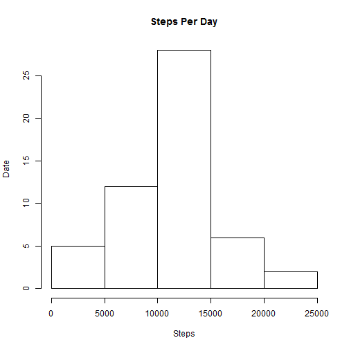
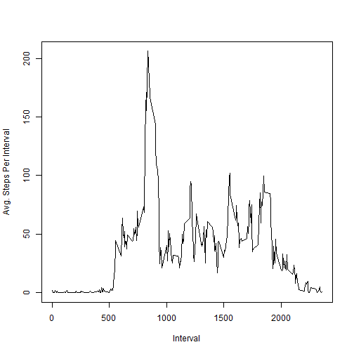
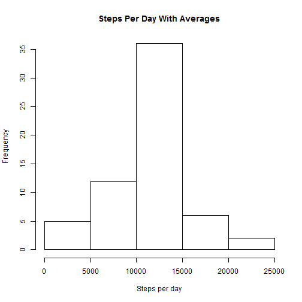
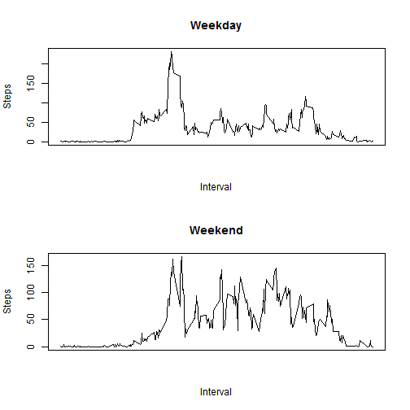

# Load the data.


```r
activity <- read.csv("activity.csv")
```

# What is mean total number of steps taken per day?

Create a data set where NA values have been removed.

```r
recorded_activity <- activity[!is.na(activity$steps),]
```

## 1. Calculate the total number of steps taken per day

```r
steps_by_day <- tapply(recorded_activity$steps, recorded_activity$date, sum)
```

## 2. Make a histogram of the total number of steps taken each day

```r
hist(steps_by_day, xlab = "Steps", ylab = "Date", main="Steps Per Day")
```



## 3. Calculate and report the mean and median of the total number of steps taken per day

```r
mean(steps_by_day, na.rm = T)
```

```
## [1] 10766.19
```

```r
median(steps_by_day, na.rm = T)
```

```
## [1] 10765
```

# What is the average daily activity pattern?

## 1. Make a time series plot (i.e. type = "l") of the 5-minute interval (x-axis) and the average number of steps taken, averaged across all days (y-axis)

```r
interval_steps<-aggregate(activity$steps, list(activity$interval), mean, na.rm=T)
names(interval_steps)<-c("interval", "steps")
plot(interval_steps$interval, interval_steps$steps, type="l", xlab = "Interval", ylab = "Avg. Steps Per Interval")
```



## 2. Which 5-minute interval, on average across all the days in the dataset, contains the maximum number of steps?

```r
head(interval_steps[with(interval_steps, order(-steps)),], 1)
```

```
##     interval    steps
## 104      835 206.1698
```

# Imputing missing values

## 1. Calculate and report the total number of missing values in the dataset (i.e. the total number of rows with NAs)

```r
nrow(activity) - nrow(recorded_activity)
```

```
## [1] 2304
```

## 2. Devise a strategy for filling in all of the missing values in the dataset. The strategy does not need to be sophisticated. For example, you could use the mean/median for that day, or the mean for that 5-minute interval, etc.

I choose the mean per interval, as this exists already.


## 3. Create a new dataset that is equal to the original dataset but with the missing data filled in.


```r
# Create a container for the step data
steps <- vector()

#Loop through activity and fill in the Steps column where NA.
for (i in 1:dim(activity)[1]) {
    if (is.na(activity$steps[i])) {
        steps <- c(steps, interval_steps$steps[interval_steps$interval == activity$interval[i]])
    } else {
        steps <- c(steps, activity$steps[i])
    }
}

filled_activity <- data.frame(steps = steps, date = activity$date, interval = activity$interval)
```


## 4. Make a histogram of the total number of steps taken each day and Calculate and report the mean and median total number of steps taken per day.

```r
hist(tapply(filled_activity$steps, filled_activity$date, sum), xlab = "Steps per day", main="Steps Per Day With Averages")
```



## Do these values differ from the estimates from the first part of the assignment?
The effect does not appear significant.

## What is the impact of imputing missing data on the estimates of the total daily number of steps?
Bias could be introduced.

# Are there differences in activity patterns between weekdays and weekends?

## 1. Create a new factor variable in the dataset with two levels - "weekday" and "weekend" indicating whether a given date is a weekday or weekend day.

```r
filled_activity$weekend <- c("weekend", "weekday", "weekday", "weekday", "weekday", "weekday", "weekend")[as.POSIXlt(filled_activity$date)$wday + 1]
filled_activity$weekend <- as.factor(filled_activity$weekend)
```

## 2. Make a panel plot containing a time series plot (i.e. type = "l") of the 5-minute interval (x-axis) and the average number of steps taken, averaged across all weekday days or weekend days (y-axis). See the README file in the GitHub repository to see an example of what this plot should look like using simulated data.

```r
weekday <- filled_activity[filled_activity$weekend == "weekday", ]
weekend <- filled_activity[filled_activity$weekend == "weekend", ]
weekday_means <- as.numeric(tapply(weekday$steps, weekday$interval, mean))
weekend_means <- as.numeric(tapply(weekend$steps, weekend$interval, mean))

interval_days <- data.frame(interval = interval_steps$interval, weekday_mean = weekday_means, weekend_mean = weekend_means)
interval_days <- interval_days[order(interval_days$interval),]

par <- par(mfrow = c(2, 1))
plot(interval_days$interval, interval_days$weekday_mean, type = "l", xlab = "Interval", ylab = "Steps", xaxt = "n", main = "Weekday")
plot(interval_days$interval, interval_days$weekend_mean, type = "l", xlab = "Interval", ylab = "Steps", xaxt = "n", main = "Weekend")
```


